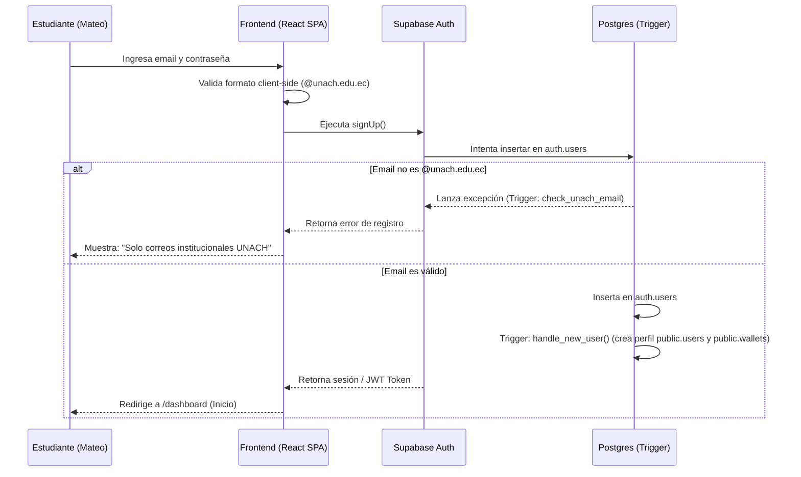
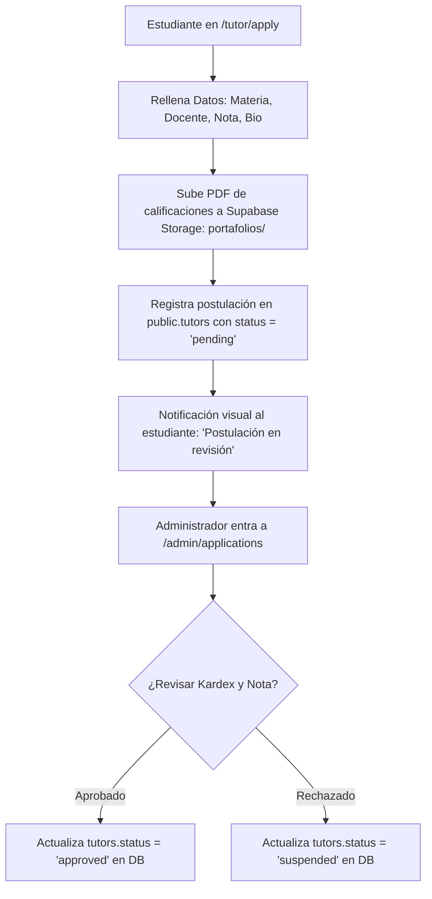
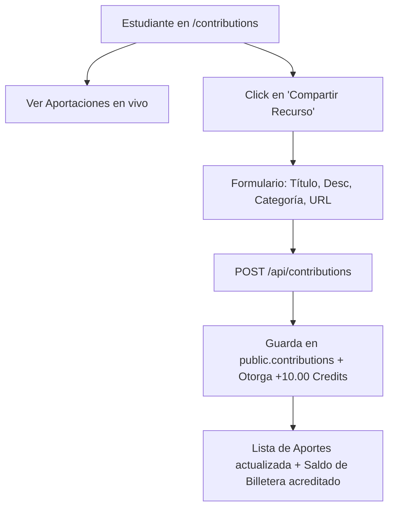

# Plan Estratégico Detallado de Implementación: UNACH-Connect

Este documento define de manera concreta y de extremo a extremo la arquitectura, flujos de trabajo, rutas y vistas para todos los módulos de **UNACH-Connect**.

---

## 1. Módulo 1: Autenticación y Registro de Usuarios

### Reglas de Negocio
1. **Restricción de Email:** Solo se permite el registro de correos electrónicos corporativos institucionales de la Universidad Nacional de Chimborazo (`@unach.edu.ec`). Esto se valida a nivel de base de datos en Supabase con un trigger antes del insert.
2. **Rol Predeterminado:** Todo usuario registrado inicia sesión estrictamente con el rol base de **Alumno (student)**. El acceso a roles especiales se gestiona mediante flujos de postulación.
3. **Sincronización:** El registro a través de Supabase Auth dispara una inserción automática en la tabla `public.users` y crea su billetera de créditos vacía (`0.00`).

### Flujo de Navegación del Usuario (Auth)

### Rutas Frontend Relacionadas (React)
*   `/login`: Vista de acceso para alumnos existentes (incluye enlace a recuperación).
*   `/register`: Formulario de registro (restringe visualmente inputs que no terminen en `@unach.edu.ec`).
*   `/forgot-password`: Formulario para solicitar el restablecimiento de contraseña enviando un correo.
*   `/reset-password`: Formulario para ingresar y confirmar la nueva contraseña tras hacer clic en el enlace de correo.

---

## 2. Módulo 2: Postulación y Aprobación de Tutores

El flujo mediante el cual un estudiante (alumno) se convierte en tutor ("referente") dentro de la plataforma.

### Reglas de Negocio
1. **Acceso al Formulario:** Cualquier estudiante logueado puede acceder a postularse como tutor desde su panel de control.
2. **Campos Requeridos:**
    *   **Asignatura propuesta** (Subject).
    *   **Docente** con el que aprobó la materia (Professor).
    *   **Nota final** obtenida en la materia (mínimo exigido: 8.5/10).
    *   **Biografía corta** (Área de especialidad y enfoque).
    *   **Documento de respaldo:** Carga del reporte de calificaciones (Kardex) o portafolio en PDF.
3. **Mapeo de Estados:**
    *   La postulación ingresa con el estado `pending`.    
    *   Un Administrador debe revisarla. Puede cambiar el estado del tutor en la tabla `tutors` a `approved` o `suspended` (rechazada).
    *   Solo cuando el estado es `approved`, sus materias asociadas se habilitan en el buscador público.

### Flujo de Postulación

---

## 3. Módulo 3: Portal de Administración

Un panel exclusivo para administradores de la UNACH para garantizar la calidad pedagógica y el control de catálogos.

### Funcionalidades del Administrador
1. **Gestión de Catálogos (CRUD):**
    *   **Asignaturas:** Añadir, editar o eliminar materias críticas (Geometría Descriptiva, Tipografía, Diseño Vectorial).
    *   **Profesores:** Registrar y actualizar el catálogo de docentes de la facultad.
2. **Cola de Aprobación de Tutores:**
    *   Tabla con las postulaciones pendientes (`status = 'pending'`).
    *   Acceso directo al PDF de calificaciones almacenado en Supabase Storage.
    *   Botón de acción rápida: **Aprobar** (habilita al tutor en el marketplace) o **Rechazar**.
3. **Auditoría Financiera:**
    *   Visualización de saldos globales de créditos estudiantiles y logs transaccionales en tiempo real.

### Rutas Frontend Relacionadas (React)
*   `/admin/dashboard`: Estadísticas de tutorías de la facultad.
*   `/admin/catalog`: Vista para crear/editar materias y profesores.
*   `/admin/applications`: Bandeja de entrada de postulaciones de tutores.

---

## 4. Módulo 4: Marketplace de Tutores (Buscador Hiper-Localizado)

Módulo principal de cara al estudiante para solucionar el "examen de mañana".

### Criterios de Búsqueda
El buscador requiere dos filtros en cascada:
1. **¿Qué materia necesitas aprobar?** (Selector de Asignaturas).
2. **¿Con qué docente?** (Selector de Profesores, opcional pero altamente valorado).

### Algoritmo de Emparejamiento (Postgres RPC `find_best_tutors`)
Llama a la base de datos y ordena los resultados priorizando:
1.  **Coincidencia de Docente:** Los tutores que aprobaron la materia con el mismo profesor específico se colocan al inicio de la lista.
2.  **Calidad Académica:** Orden descendente por calificación promedio de tutorías previas (`rating_avg`).
3.  **Economía:** Menor precio por hora (`price_per_hour`).

---

## 5. Módulo 5: Billetera de UNACH-Credits (Versión Monedero Simple)

Un monedero para gestionar el flujo financiero interno sin dinero físico.

### Funciones en el Dashboard del Alumno/Tutor
1. **Visualización de Saldo:** Muestra el balance acumulado actual (ej. *"Tienes 45.00 UNACH-Credits"*).
2. **Obtención de Créditos (Incentivo Colaborativo):**
    *   Cada vez que un estudiante publica una aportación/recurso válido en el Foro Académico (`/contributions`), el sistema le otorga de forma automática **+10.00 UNACH-Credits** en su billetera.
3. **Historial de Transacciones (Ledger):** Lista detallada con:
    *   Fecha.
    *   Concepto (ej. *"Recompensa por aporte en el Foro Académico (+10.00 Credits)"*, *"Canje en Copiadora Express"*).
    *   Monto (verde para ingresos `+`, rojo para consumos `-`).
4. **Generación de Canje:**
    *   El estudiante selecciona cuántos créditos desea canjear en un comercio asociado.
    *   Se genera un código alfanumérico temporal único de 8 dígitos (guardado en `public.redemption_codes` con expiración de 10 minutos).
    *   El código se dibuja dinámicamente en pantalla como código de barra o código QR.

### Flujo de Canje por el Comercio Aliado (Partner Portal)
1. El comercio aliado inicia sesión en la app en su cuenta en la ruta `/partner`.
2. Escanea el código QR del estudiante con la cámara de su celular o digita el código de 8 dígitos de forma manual.
3. El frontend del comercio envía la petición al backend (`POST /api/partner/redeem`).
4. El backend verifica la vigencia del código, transfiere los créditos del monedero del alumno al comercio, y cambia el estado del código a `claimed`.
5. El comercio entrega el material físico (impresiones/ploteos/librería) al alumno.

---

## 6. Módulo 6: Agendamiento Express (Fricción Cero - WhatsApp)

Un flujo rápido de contacto que evita largos formularios para Mateo.

### Flujo Técnico de Agendamiento
1. En el perfil del tutor seleccionado, el alumno pulsa el botón **"Agendar por WhatsApp"**.
2. El sistema realiza una llamada a la API (`POST /api/tutoring-sessions`) para registrar la sesión en la base de datos con estado `requested`.
3. El frontend intercepta el éxito de la petición y genera un enlace dinámico hacia la API pública de WhatsApp Web/App:
   `https://wa.me/[TeléfonoTutor]?text=[MensajePreconfigurado]`
4. **Mensaje Autogenerado Ejemplo:**
   > *"¡Hola [Nombre Tutor]! Vi tu perfil en UNACH-Connect. Necesito ayuda con la materia de [Materia] que estás dictando con el profesor [Nombre Profesor]. ¿Tienes disponibilidad esta semana?"*
5. El estudiante es redirigido a WhatsApp, entablando conversación inmediata en menos de 3 clics.

---

## 7. Módulo 7: Portal de Aportaciones Estudiantiles (Foro de Recursos)

Este módulo fomenta la colaboración académica descentralizada permitiendo que cualquier estudiante comparta recursos y guías de auto-estudio.

### Reglas de Negocio
1. **Acceso:** Todos los estudiantes autenticados pueden ver la lista de aportes y publicar contenido.
2. **Recompensa por Aporte:** Al guardar una publicación de manera exitosa, el backend registra automáticamente una transacción de **+10.00 UNACH-Credits** en la tabla `credit_transactions` del alumno autor.
3. **Campos Requeridos:**
    *   **Título** del recurso o aportación.
    *   **Descripción** detallada o explicación.
    *   **Categoría:** Tipo de recurso (`tutorial`, `recurso`, `consejo_general`).
    *   **URL del Recurso:** Enlace externo obligatorio (ej. OneDrive, Google Drive, YouTube, GitHub).
4. **Propiedad y Moderación:**
    *   Un alumno solo puede eliminar o editar sus propios aportes.
    *   Los administradores pueden eliminar cualquier aporte que no cumpla las normas académicas de la UNACH.

### Flujo del Foro

---

## 8. Arquitectura de Endpoints (Backend Laravel API)

A continuación se detallan las rutas a implementar en `routes/api.php` protegidas por el middleware de Supabase:

| Método | Endpoint | Middleware | Descripción |
|---|---|---|---|
| **POST** | `/api/auth/sync` | Ninguno | Sincroniza datos de registro de Supabase Auth en la DB pública |
| **GET** | `/api/subjects` | Autenticado | Lista de asignaturas disponibles en catálogo |
| **GET** | `/api/professors` | Autenticado | Lista de profesores del catálogo |
| **POST** | `/api/tutors/apply` | Autenticado | Crea postulación de tutor y sube el Kardex/PDF |
| **GET** | `/api/tutors/search` | Autenticado | Llama al RPC `find_best_tutors` con filtros de búsqueda |
| **GET** | `/api/admin/applications` | Admin | Bandeja de postulaciones de tutores pendientes |
| **PUT** | `/api/admin/applications/{tutor}/status` | Admin | Aprueba (`approved`) o rechaza (`suspended`) una postulación |
| **GET** | `/api/wallet/balance` | Autenticado | Retorna saldo actual y logs de transacciones del monedero |
| **POST** | `/api/wallet/redeem/code` | Autenticado | Genera un código QR/Alfanumérico de canje temporal |
| **POST** | `/api/partner/redeem/claim` | Partner | Valida y reclama un código de canje para entregar los servicios |
| **POST** | `/api/tutoring-sessions` | Autenticado | Registra una sesión de tutoría previa a redirigir a WhatsApp |
| **GET** | `/api/contributions` | Autenticado | Lista todas las aportaciones del foro de estudiantes |
| **POST** | `/api/contributions` | Autenticado | Publica un nuevo recurso/aporte en el foro |
| **DELETE** | `/api/contributions/{id}` | Autenticado | Elimina una aportación (solo creador o administrador) |

---

## 9. Estructura de Páginas y Enrutador Frontend (React SPA)

El frontend utiliza `react-router-dom` con layouts compartidos basados en roles:

*   **Páginas Públicas (TOFU):**
    *   `/` (Landing Page con visual estilo revista y Red Luminosa de partículas).
*   **Páginas de Cuenta / Estudiantes (Alumno Base):**
    *   `/login` y `/register` (Acceso exclusivo `@unach.edu.ec`).
    *   `/forgot-password` y `/reset-password` (Recuperación de credenciales).
    *   `/dashboard` (Resumen del perfil, billetera de créditos y solicitudes de tutorías).
    *   `/search` (Marketplace interactivo con filtros cruzados materia/profesor).
    *   `/tutors/:id` (Perfil detallado del tutor, portafolio y botón WhatsApp).
    *   `/tutor/apply` (Formulario de postulación cargando PDF de calificaciones).
    *   `/contributions` (Foro de aportaciones académicas de estudiantes, buscador y formulario modal).
*   **Páginas de Comercios Aliados (Partner):**
    *   `/partner/redeem` (Lector de códigos QR y caja de texto para digitar códigos de canje de ploteos/librería).
*   **Páginas de Administración (Admin):**
    *   `/admin/dashboard` (Métricas de la plataforma).
    *   `/admin/applications` (Panel de aprobación/suspensión de postulaciones de tutores).
    *   `/admin/catalog` (CRUD de materias y profesores).
